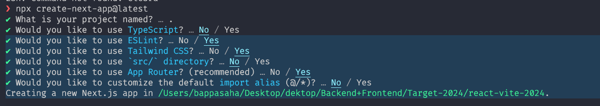

This is a [Next.js](https://nextjs.org/) project bootstrapped with [`create-next-app`](https://github.com/vercel/next.js/tree/canary/packages/create-next-app).

## Getting Started




First, run the development server:

```bash
npm run dev
# or
yarn dev
# or
pnpm dev
# or
bun dev

```

Open [http://localhost:3000](http://localhost:3000) with your browser to see the result.


### My Other Next js projects [typescript+redux+rtk]

-  [next-js-13.4-pageRoute-app](https://github.com/bappasahabapi/next-js-13.4-pageRoute-app)
-  [next-js-13.4-pagebase-NewsPortal](https://github.com/bappasahabapi/next-js-13.4-pagebase-NewsPortal)
-  [next-js13-page-projects](https://github.com/bappasahabapi/next-js13-page-projects)

You can start editing the page by modifying `app/page.js`. The page auto-updates as you edit the file.

This project uses [`next/font`](https://nextjs.org/docs/basic-features/font-optimization) to automatically optimize and load Inter, a custom Google Font.


## Deploy on Vercel

The easiest way to deploy your Next.js app is to use the [Vercel Platform](https://vercel.com/new?utm_medium=default-template&filter=next.js&utm_source=create-next-app&utm_campaign=create-next-app-readme) from the creators of Next.js.

Check out our [Next.js deployment documentation](https://nextjs.org/docs/deployment) for more details.
