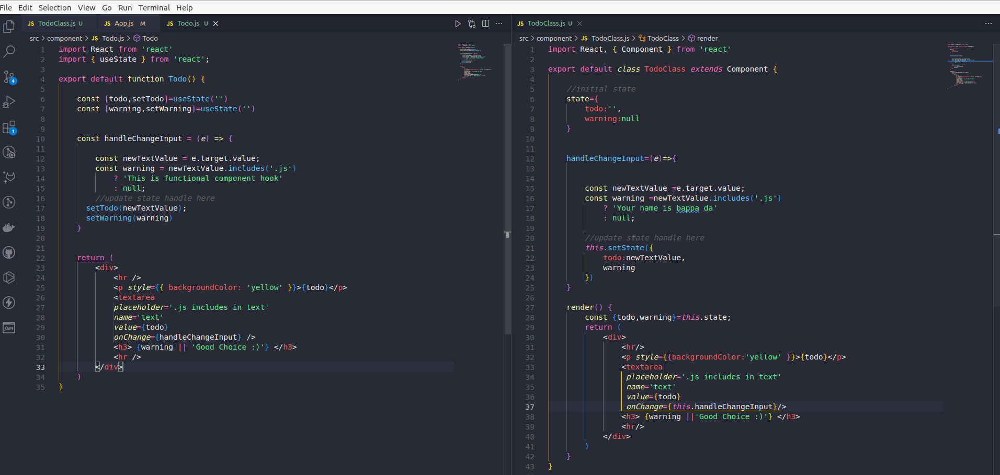
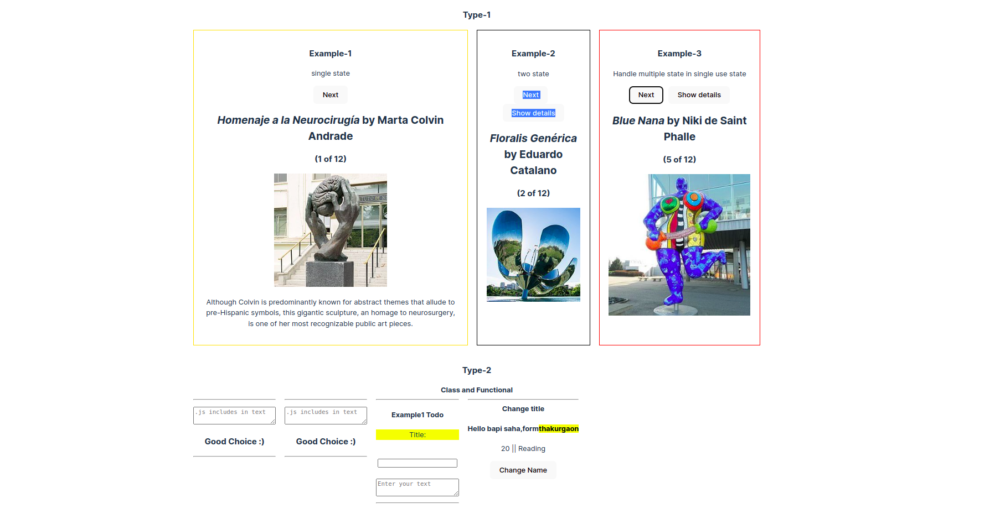

`npm run dev`

#    2.0 React Hooks:

- React hooks are  introduced in 2019 in react version 16.8_+
- Hooks can not be used inside class component.

**What hooks solved?**

- State 
- Life Cycle Method
- Duplicate Code
- Sharing Same Logic

**Hook Rules**

- Hook is used in top level.
- এখানে, **প্রথম ইনডেক্সে** থাকবে `ভেরিয়েবল` (todo) এবং দ্বিতীয় ইনডেক্সে থাকবে `ফাংশন` (setTodo)

- This hook return an array.

`আমরা একটি অ্যারে থেকে মান গুলি নিতে চাইব, এবং আমাদের অ্যারে ডিস্ট্রাকচারিং করতে হবে that is অবজেক্ট ডিস্ট্রাকচারিং করার মত।`
 
- [useState hook class component note](https://github.com/bappasahabapi/react-core-concept/tree/2.0-react-useState-hook)

<h3>Convert Class to Functional<h3/>

<h3>Result<h3/>

