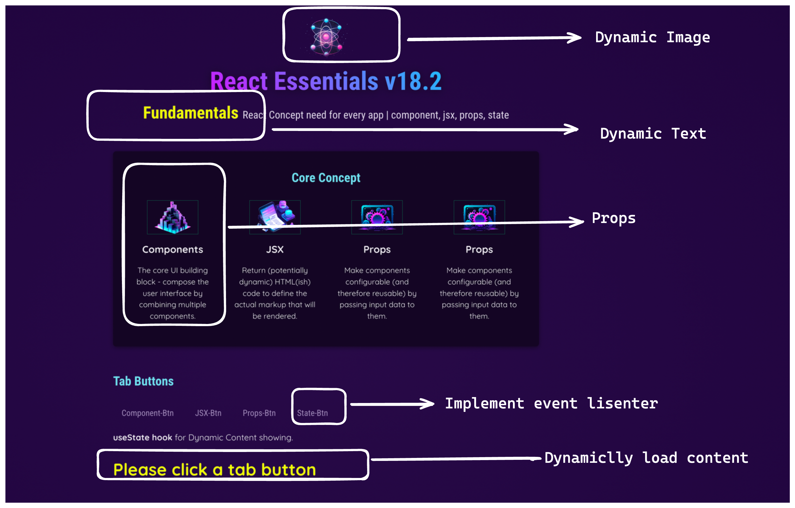

# React Component jsx props state:
- Run the project :`npm install` and then  `npm run dev`


- **Implemented:**

-    From pdf: page 40 starts: 
### Topic:1
🔥 [Project-link](https://github.com/bappasahabapi/react-vite-2024/tree/section-3/component_jsx_props_state)
    - ➡️ Building User Interface with Components 
    - ➡️ Using Sharing Outputing Data
    - ➡️ Handling User Events
    - ➡️ Building Interactive UIs with States


- **T-01**
    - Css styling & Dynamic Styling for tab button
    - Rendering Content dynamically for each tab button.
    - isActive functionality for which tab is currently active
    - implement events for tab buttons 
    - dynamically text and image loding for each refresh
    - useState hook is implemented for showing the content in the UI.
---

### Topic:2

- ➡️ Building User Interface with Components 
- ➡️ Using Sharing Outputing Data
- ➡️ Handling User Events
- ➡️ Building Interactive UIs with States

- **T-02**
    - **spliting** the code base
    - **Forwaring Props** concept (...props)
    - Multiple Component Slots
    - Element Identifier as props
    - Defalut Props value
    - **Tic Tac toe** 
        - Multiple State Variable 
        - Lifting State Up
        - Derived State
        - Nested Lists
        - Array and Object State
        - Component Functions vs Normal Functions


## 8. React Props

<aside>
✅ **আমরা বাহিরে থেকে যা পাঠাই তা হলো props। props is an object which is referance value**

</aside>

<aside>
✅ React components use *props* to **communicate** with each other

প্রতিটি parent কম্পোনেন্ট **প্রপার্টিস** দেয়ার মাধ্যমে তার child কম্পোনেন্টগুলিকে কিছু **তথ্য** পাঠাতে পারে। 
Props আপনাকে এইগুলি HTML attribute মধ্যে মনে করতে পারে, 

but you can **pass any JavaScript value through them**, including objects, arrays, and functions.

</aside>

```jsx
function Avatar({ person, size = 100 }) {
  // ...
}
```

Now, if `<Avatar person={...} />` is rendered with no `size` prop, the `size` will be set to `100`.

The default value is only used if the `size` prop is missing or if you pass `size{undefined}`. But if you pass `size={null}` or `size={0}`, the default value will **not** be used.

- **লেআউটিং** করার সময়ে **children** props বেশি ব্যবহৃত হয়।”
- Props are **Immutable and** props are not always **static**

"props ইমিউটেবল করা হয়েছে কারণ এগুলি every time parent theke নতুন অবজেক্ট child e পাঠায় এবং পূর্বের রেফারেন্স অবজেক্টটি গার্বেজ হিসেবে মুছে ফেলা হয়।”


##    Basic vite 

`npm run dev`

-  [Notes](https://snapdragon-mambo-8cb.notion.site/React-Note-2024-937311c869de4060b21fc37dd2120e33)
## React + Vite 2024 
<br>

<details>
<summary> 1️⃣. Describing UI 🔥 </summary>

-  🔥 [1.8-React Props](https://github.com/bappasahabapi/react-vite-2024/tree/r18/1.8-react-props)
-  🔥 [1.9-Rendering List](https://github.com/bappasahabapi/react-vite-2024/tree/r18/1.9-rendering-list)
-  🔥 [r1-Smart-Grade-Task](https://github.com/bappasahabapi/react-vite-2024/tree/r18/task)

</details>

<details>
<summary> 2️⃣. Adding InterActivity 🔥 </summary>

-  🔥 [2.3-Component memory-useState](https://github.com/bappasahabapi/react-vite-2024/tree/r2/2.3-component-memory)
-  🔥 [2.10-Tasker](https://github.com/bappasahabapi/react-vite-2024/tree/r2/2.10-tasker)
-  🔥 [2.10-Tasker Functional](https://github.com/bappasahabapi/react-vite-2024/tree/r2/2.10-tasker-functional)
-  🔥 [r2-Book Search App](https://github.com/bappasahabapi/react-vite-2024/tree/r2/task-book-search)


</details>

<details>
<summary> 3️⃣.State Management 🔥 </summary>

-  🔥 [2.3-Component memory-useState]()


</details>


##  Main Concept
[Official Note](https://bappa-saha.web.app/)

- 🔥🔥🔥[stater pack ](https://github.com/bappasahabapi/react-core-concept/tree/starter)
- 🎮🎮  [2.0-Tic Tac Toy](https://github.com/bappasahabapi/react-core-concept/tree/02/main/tic-tac-toe).**[both dom and react code]**

<h6>📚 React Previous Concept 2019 <a href="https://github.com/bappasahabapi/ReactApp"> Click 👉 link</a></h6> 
--- 
 
<details>

<summary>📚 React Main Concepts</summary>


- 05 🔥 [1.10-Lifting-up-state](https://github.com/bappasahabapi/react-core-concept/tree/1.10-lifting-state-up)
- 04 🔥 [1.9-Handle React Form](https://github.com/bappasahabapi/react-core-concept/tree/1.9-handle-react-forms)
- 03 🔥 [1.3-conditional-rendering](https://github.com/bappasahabapi/react-core-concept/tree/1.3-conditional-redering).
- 02 🔥 [1.2-props](https://github.com/bappasahabapi/raect-manage-forms/tree/1.2-props).
- 01 🔥 **Handling with multiple inputs in one useState** [1.1-managing multiple input fields](https://github.com/bappasahabapi/raect-manage-forms/tree/1.1-managing-multiple-input-fields).
<br>
</details>

<details>

<summary>📚 React 2.0 Hooks</summary>

- 06 🔥 [React useState hook](https://github.com/bappasahabapi/react-core-concept/tree/2.0-react-useState-hook)

</details>
