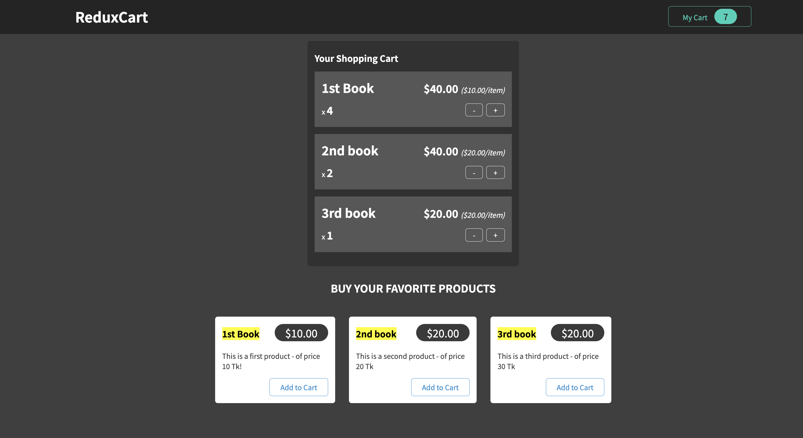

##   🟩 Redux
-  `npm install react-redux`    
- `npm install @reduxjs/toolkit `

<!--  -->

**🌳 Branch:**
- 💥 section-3:[component-jsx-props-useState()](https://github.com/bappasahabapi/react-vite-2024/tree/section-3/component_jsx_props_state)

- 💥 section-4:[Lifting State Up ](https://github.com/bappasahabapi/react-vite-2024/tree/section-4/lifting_state)
- 💥 section-11: [UseEffect( ) Hook](https://github.com/bappasahabapi/react-vite-2024/tree/section-11-useEffectHook)

---

  
- 🌳 [Next js-14 Starer](https://github.com/bappasahabapi/react-vite-2024/tree/starter/Nextjs-14)
- 🌳 [Next js-14 Basic Routing-[r7]](https://github.com/bappasahabapi/react-vite-2024/tree/r7/7.0/Nextjs-14/basic-routing)

  - 🚇 Implemented Project is: [nextjs-14-documentation-app](https://github.com/bappasahabapi/nextjs-14-documentation-app)

- 🌳 [Next js-14 Advanced Routing-[r8]](https://github.com/bappasahabapi/react-vite-2024/tree/r8/8.0/Nextjs-14/Advanced-routing)
  - 🚇 Implemented Project is: [nextjs-14-Photo Gallary](https://github.com/bappasahabapi/react-vite-2024/tree/r8-PhotoGallary)
- 🌳 [Data Fetching & Caching & Revalidation-[r9]]()
    - 🚇 Implemented Project is: [[nextjs-14-Eco System Weather Dashboard]]()
- 🌳 [Rendering & Optimizing-[r10]]()
    - 🚇 Implemented Project is: [nextjs-14-Event-Project]()

### 🟩 My Other Next js projects [typescript+redux+rtk+antd]
---

-  [RMSTU-Frontend-13.4 app-base](https://github.com/bappasahabapi/rmstu-frontend)
-  [next-js-13.4-pageRoute-app](https://github.com/bappasahabapi/next-js-13.4-pageRoute-app)
-  [next-js-13.4-pagebase-NewsPortal](https://github.com/bappasahabapi/next-js-13.4-pagebase-NewsPortal)
-  [next-js13-page-projects](https://github.com/bappasahabapi/next-js13-page-projects)

## 🟩 React + Vite 2024 
---

📚   [Notes](https://snapdragon-mambo-8cb.notion.site/React-Note-2024-937311c869de4060b21fc37dd2120e33)

**🌳 Branch:**
- 💥 section-3:[component-jsx-props-useState()](https://github.com/bappasahabapi/react-vite-2024/tree/section-3/component_jsx_props_state)

- 💥 section-4:[Lifting State Up ](https://github.com/bappasahabapi/react-vite-2024/tree/section-4/lifting_state)
- 💥 section-11: [UseEffect( ) Hook](https://github.com/bappasahabapi/react-vite-2024/tree/section-11-useEffectHook)

- 💥 section-17:[User Input Form ](https://github.com/bappasahabapi/react-vite-2024/tree/section-17/working-user-form-input-validation)

 

 1️⃣. Describing UI 🔥 

-  🔥 [1.8-React Props](https://github.com/bappasahabapi/react-vite-2024/tree/r18/1.8-react-props)
-  🔥 [1.9-Rendering List](https://github.com/bappasahabapi/react-vite-2024/tree/r18/1.9-rendering-list)
-  🔥 [r1-Smart-Grade-Task](https://github.com/bappasahabapi/react-vite-2024/tree/r18/task)

 2️⃣. Adding InterActivity 🔥 

-  🔥 [2.3-Component memory-useState](https://github.com/bappasahabapi/react-vite-2024/tree/r2/2.3-component-memory)
-  🔥 [2.10-Tasker](https://github.com/bappasahabapi/react-vite-2024/tree/r2/2.10-tasker)
-  🔥 [2.10-Tasker Functional](https://github.com/bappasahabapi/react-vite-2024/tree/r2/2.10-tasker-functional)
-  🔥 [r2-Book Search App](https://github.com/bappasahabapi/react-vite-2024/tree/r2/task-book-search)

 3️⃣.State Management 🔥 

-  🔥 [2.3-Component memory-useState]()

##  🟩 Main Concept
---
[Official Note](https://bappa-saha.web.app/)

- 🔥🔥🔥[stater pack ](https://github.com/bappasahabapi/react-core-concept/tree/starter)
- 🎮🎮  [2.0-Tic Tac Toy](https://github.com/bappasahabapi/react-core-concept/tree/02/main/tic-tac-toe).**[both dom and react code]**

<h6>📚 React Previous Concept 2019 <a href="https://github.com/bappasahabapi/ReactApp"> Click 👉 link</a></h6> 
--- 
 

📚 React Main Concepts

- 05 🔥 [1.10-Lifting-up-state](https://github.com/bappasahabapi/react-core-concept/tree/1.10-lifting-state-up)
- 04 🔥 [1.9-Handle React Form](https://github.com/bappasahabapi/react-core-concept/tree/1.9-handle-react-forms)
- 03 🔥 [1.3-conditional-rendering](https://github.com/bappasahabapi/react-core-concept/tree/1.3-conditional-redering).
- 02 🔥 [1.2-props](https://github.com/bappasahabapi/raect-manage-forms/tree/1.2-props).
- 01 🔥 **Handling with multiple inputs in one useState** [1.1-managing multiple input fields](https://github.com/bappasahabapi/raect-manage-forms/tree/1.1-managing-multiple-input-fields).
 

📚 React 2.0 Hooks

- 06 🔥 [React useState hook](https://github.com/bappasahabapi/react-core-concept/tree/2.0-react-useState-hook)

