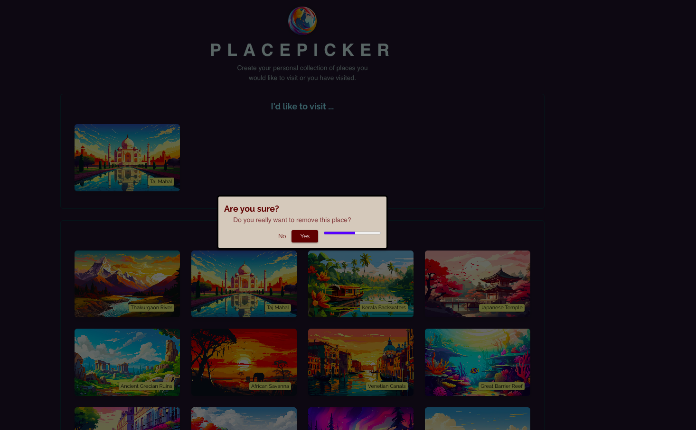

### [PlacePicker Code](https://github.com/bappasahabapi/react-vite-2024/tree/section-11-useEffectHook/01-starting-project)

### [Sending HTTP Request PlacePicker Code](...)

### [Using Custom Hook PlacePicker Code](https://github.com/bappasahabapi/react-vite-2024/tree/section-11-useEffectHook/16-custom-hooks)
Run the project

- `cd 01-starting-project`
- `npm install`
- `npm run dev`

Run the project

- `cd 01-starting-project`
- `npm install`
- `npm run dev`

